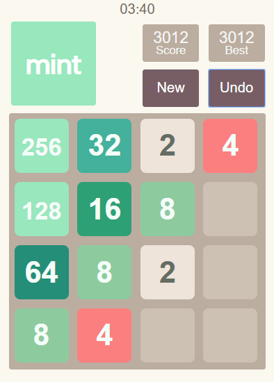

Mint 2048

2048 Mint is a puzzle game based on Gabrielle Cirulli's 2048 made in React. Match, add tiles and use abilities to create the 2048 tile.

### Play at https://plus-7ed02.firebaseapp.com/
 

***

In the project directory, run `npm start` to run the app in development mode at localhost:3000.
